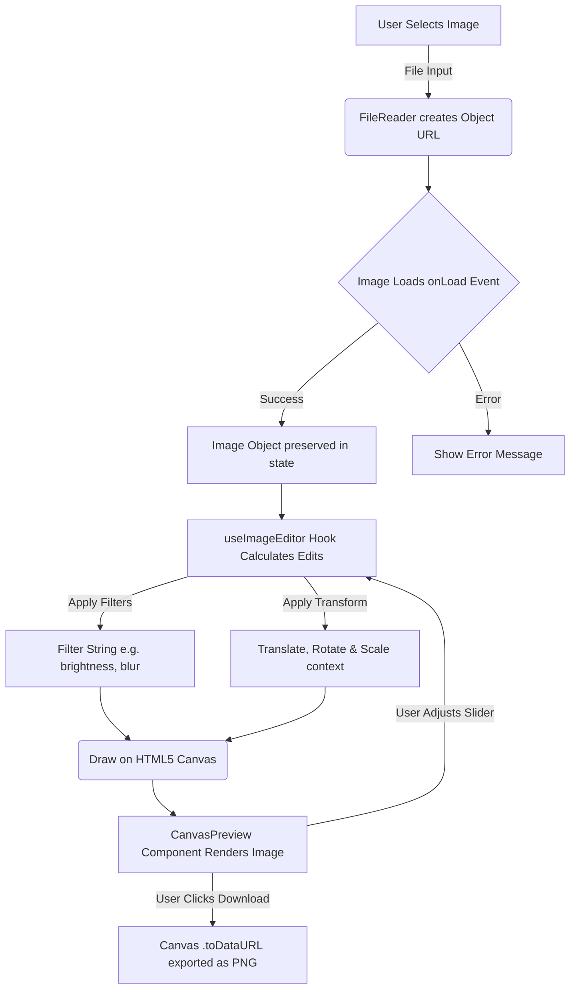

# Image Editor Pro 🎨

A modern, fast, and feature-rich Image Editor built using **React**, **TypeScript**, and **Vite**. This application leverages the HTML5 Canvas API to provide professional-grade image manipulation directly in the browser, ensuring quick performance and privacy (all edits happen client-side).

## ✨ Features

- **Rich Image Filters**: Adjust Brightness, Contrast, Saturation, Hue Rotation, Blur, Grayscale, Sepia, Opacity, and Invert.
- **Transformations**: Freely rotate and flip (horizontal/vertical) images.
- **Cropping Tool**: Crop images using various aspect ratios or freely.
- **Undo / Redo History**: Confidently edit with a full history stack.
- **Compare Mode**: Instantly check your edits against the original image.
- **Client-Side Editing**: Images are manipulated entirely in the browser via Canvas API, ensuring no data leaves the user's device.
- **Download**: Save your edited master-pieces directly to your device as PNG.

## 💻 Tech Stack

- **Framework**: React 19 (Hooks, Functional Components)
- **Tooling**: Vite (Fast HMR & Optimized Builds)
- **Language**: TypeScript (Type safety across components and hooks)
- **Styling**: SCSS / CSS
- **Routing**: React Router DOM (Landing Page & Editor Workspace)
- **SEO & Meta**: React Helmet Async

## 📂 Project Structure

```text
src/
├── api/             # API Integrations (if any in future)
├── assets/          # Static assets like images and icons
├── components/      # Reusable UI components (CanvasPreview, Forms, etc.)
├── features/        # Feature-specific components
│   ├── controls/    # Toolbar, Sidebar, and Editor Controls
│   └── filters/     # Filter adjustment sliders/inputs
├── hooks/           # Custom hooks
│   └── useImageEditor.ts # Core logic for Canvas image manipulation
├── layouts/         # Layout wrappers
├── pages/           # Page-level components
│   ├── LandingPage.tsx   # Intro & CTA
│   └── EditorWorkspace.tsx # The Main App Interface
├── types/           # TypeScript definitions (editor states, filters, etc.)
├── App.tsx          # Main Router Setup
└── main.tsx         # Application Entry Point
```

## ⚙️ How the Image Loading & Editing Works (Flow)



*Note on Image Loading: The application relies strictly on the `onload` asynchronous event to ensure the image object is fully loaded into memory before painting it onto the Context 2D canvas.*

## 🚀 Getting Started

1. **Install Dependencies**
   ```bash
   npm install
   ```

2. **Run Development Server**
   ```bash
   npm run dev
   ```

3. **Build for Production**
   ```bash
   npm run build
   ```

## 📜 License
This project is for educational and portfolio purposes.
